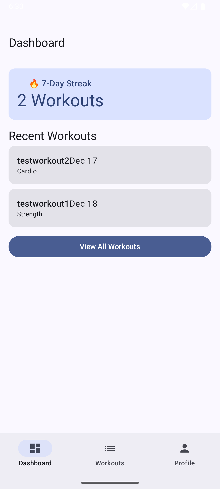
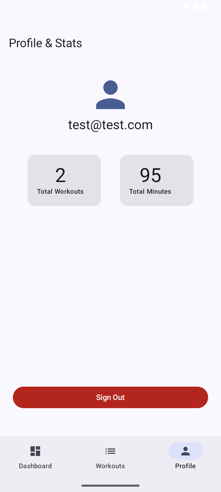
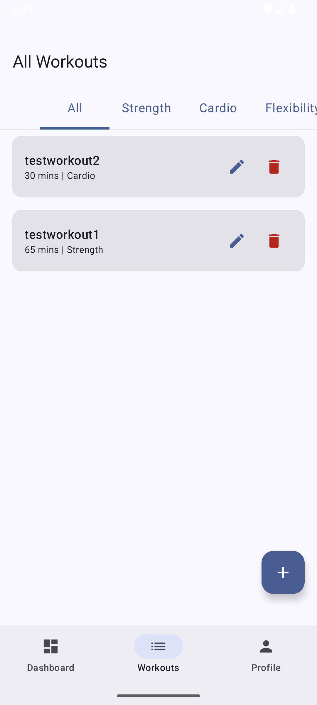
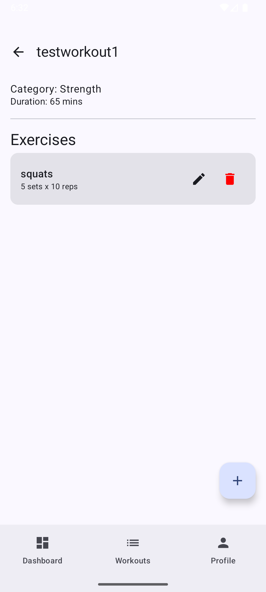
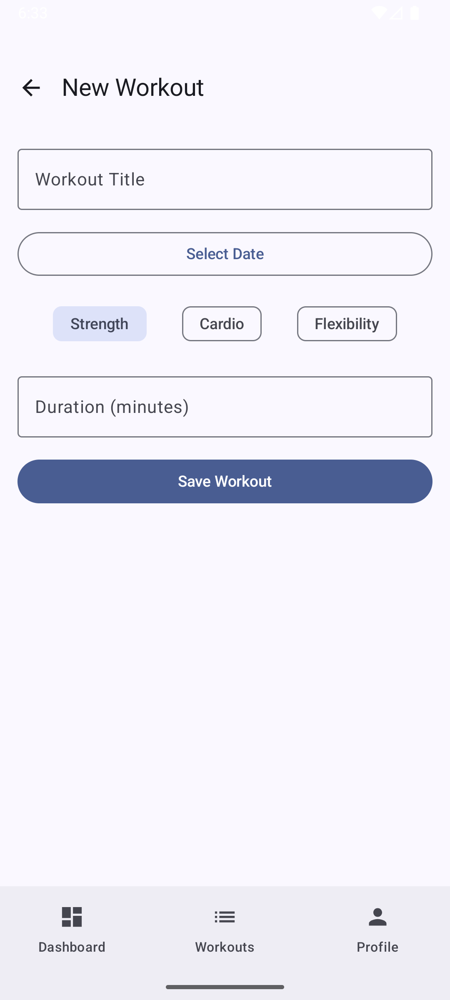
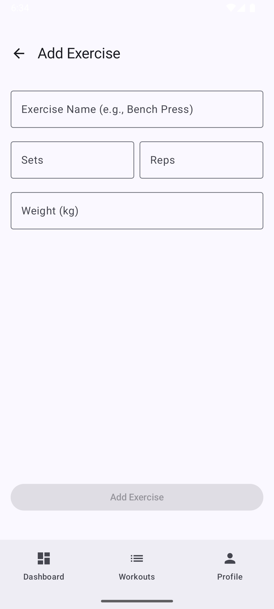

# FitTrack - Workout Tracker
by Joshua Kuschner - CWID: 861466472

## Project Overview
FitTrack is a fitness compainion build with Jetpack Compose and Firebase. It allows users to track their fitness journey through a hierarchy of Workouts and Exercises. Every user has a private, secure space to track their progress.

### Core Features
- Authentication: Secure Email/Password sign-up and login with persistent session management.
- Workout Management: Create, Read, Update, and Delete (CRUD) workouts with tracking for duration and category.
- Exercise Tracking: Nested CRUD functionality allows uers to add specific exercises, sets, reps, and weights to any workout.
- Real-time Sync: Powered by Firebase Firestore for isntant updates across devices.
- User Statistics: Profile dashboard showing total number of workouts and total time spent working out.

## Screenshots

### Login Screen

### Sign Up Screen

### Dashboard Screen

### Profile Screen

### Workouts List Screen

### Workout Details Screen

### Add Workout Screen

### Add Exercise Screen

## Demo Video Link
[Click here to see the video!](https://youtu.be/7O7WGTUFK3I)

## Project Setup
1. Clone the repo
2. Firebase config:
   1. Place `google-services.json` file in `app/` directory
   2. Enable Email/Password Auth in Firebase Console
   3. Create a Firestore Database in "Test Mode" or set rules to allow authenticated users
3. Build Project
   1. Sync Gradle files in Android Stuido
   2. Ensure `minSdk` is set to 24 or higher
4. Run